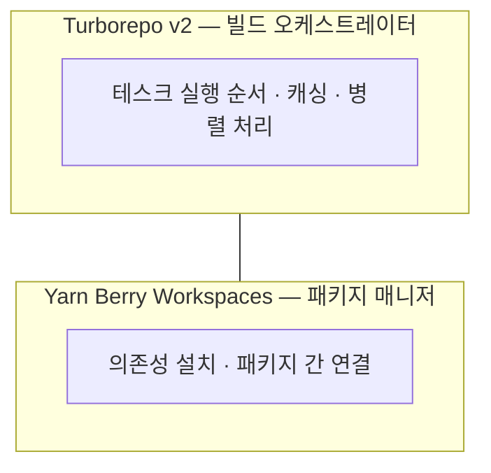

import { Image } from "astro:assets";
import coldBuildBefore from "./cold-build-before.png";
import coldBuildAfter from "./cold-build-after.png";
import sellerBuildBefore from "./seller-build-before.png";
import sellerBuildAfter from "./seller-build-after.png";
import sharedPackageBuildBefore from "./shared-package-build-before.png";
import sharedPackageBuildAfter from "./shared-package-build-after.png";

> Admin 서비스 추가가 확정된 시점에 Seller 서비스와의 공유 자원(디자인 시스템, 아이콘, 디자인 토큰) 중복 문제를 사전에 파악하고, Yarn Workspaces + Turborepo 기반 모노레포를 설계한 과정을 기술합니다. Cold build 약 9초 대비 캐시 히트 시 36~64ms(약 99% 단축)의 빌드 성능 개선 결과를 포함합니다.

---

## 1. 문제 인식: 무엇이 중복되는가

기존 Seller 서비스(`dessert-front-seller`)는 단독 저장소로 운영되고 있었습니다. Admin 서비스가 별도 저장소로 추가될 경우, 두 서비스가 반드시 공유해야 할 항목이 명확히 존재합니다.

- **디자인 시스템 컴포넌트**: `Button`, `Input`, `Modal`, `Badge` 등 디자인팀이 정의한 순수 UI 컴포넌트
- **SVGR 아이콘 컴포넌트**: Figma에서 export된 아이콘 컴포넌트
- **디자인 토큰**: 컬러, 타이포그래피, 스페이싱 CSS 변수

이 항목들을 두 저장소에 각각 복사하여 관리하면, 디자인 변경이 발생할 때마다 두 곳을 동시에 수정해야 합니다. 수정이 누락되면 두 서비스 간 UI 불일치가 발생하고, 이는 사용자 경험에 직접적인 영향을 미칩니다.

### 단순 npm 패키지 배포를 선택하지 않은 이유

공유 컴포넌트를 독립 npm 패키지로 배포하고 두 저장소에서 설치하는 방법도 있습니다. 그러나 소규모 팀 환경에서는 다음과 같은 문제가 발생합니다.

- 컴포넌트를 수정할 때마다 **버전 올리기 → 배포 → 각 저장소에서 업그레이드** 사이클이 필요
- 로컬 개발 중 `npm link` 같은 임시 방편이 필요
- 동일 팀이 두 서비스를 함께 개발하는 상황에서 비용 대비 이점이 없음

동일 팀이 공통 디자인 시스템을 공유하는 상황에서는 **모노레포의 workspace 참조**로 관리하는 것이 더 적합합니다.

---

## 2. 아키텍처 결정: 스택 선택 근거

### Yarn Berry(v4) Workspaces — 기존 환경 유지

패키지 매니저를 교체하는 것은 팀 전체의 개발 환경을 변경하는 작업입니다. Seller 저장소는 이미 `yarn@4.11.0`(Yarn Berry)을 사용하고 있었으며, Yarn Berry Workspaces는 모노레포를 완전하게 지원합니다.

pnpm으로의 마이그레이션도 검토했으나, 기존 환경을 유지하는 것이 실용적인 선택이었습니다.



두 도구는 역할이 다르며, 함께 사용해야 합니다. Yarn Workspaces는 패키지 간 의존성 연결을 담당하고, Turborepo는 테스크 실행 순서와 캐싱을 최적화합니다.

### Turborepo — 빌드 캐싱

Yarn Workspaces만 사용하면 `yarn build` 실행 시 코드 변경 여부와 관계없이 **전체를 처음부터 다시 빌드**합니다. Turborepo는 빌드 결과를 **입력 파일의 해시값으로 캐싱**하며, 소스코드와 환경변수가 동일한 경우 캐시에서 즉시 반환합니다.

세 가지 시나리오를 기준으로 빌드 성능을 측정했습니다.

#### 시나리오 1 — Cold build (캐시 없음)

캐시가 없는 최초 빌드 상태입니다. `ui`, `seller`, `admin` 3개 테스크가 모두 처음부터 실행됩니다.

<Image src={coldBuildBefore} alt="Cold build 결과 — Cached: 0/3, Time: 8.969s" />

동일한 조건으로 재실행하면 입력값이 변경되지 않았으므로 3개 테스크 전부 캐시에서 복원됩니다.

<Image src={coldBuildAfter} alt="캐시 히트 결과 — Cached: 3/3, Time: 36ms FULL TURBO" />

8.969s → 36ms, 약 99.6% 단축입니다.

#### 시나리오 2 — Seller 앱 코드만 수정

`apps/seller` 코드를 변경한 경우입니다. `@dessert/ui`와 `@dessert/admin`은 입력값이 변경되지 않았으므로 캐시에서 복원되고, seller 빌드만 새로 실행됩니다.

<Image src={sellerBuildBefore} alt="seller 코드 수정 후 빌드 — Cached: 2/3, Time: 7.094s" />

동일한 조건으로 재실행하면 3개 테스크 전부 캐시 히트입니다.

<Image src={sellerBuildAfter} alt="seller 수정 후 재실행 — Cached: 3/3, Time: 47ms FULL TURBO" />

#### 시나리오 3 — 공유 패키지(`@dessert/ui` · `@dessert/icons`) 수정

공유 패키지를 수정한 경우입니다. `packages/ui`가 변경되면 이를 의존하는 seller와 admin 모두 재빌드가 필요합니다. `turbo.json`의 `"dependsOn": ["^build"]` 설정에 의해 빌드 순서(`ui → seller`, `ui → admin`)가 자동으로 보장됩니다.

<Image src={sharedPackageBuildBefore} alt="shared 패키지 수정 후 빌드 — Cached: 1/3, Time: 7.235s" />

동일한 조건으로 재실행하면 전부 캐시 히트입니다.

<Image src={sharedPackageBuildAfter} alt="shared 패키지 수정 후 재실행 — Cached: 3/3, Time: 64ms FULL TURBO" />

---

## 3. 최종 디렉토리 구조

기존 `dessert-front-seller` 저장소 이름을 `dessert-front-dashboard`로 변경하고, 다음 구조로 재구성했습니다.

```

dessert-front-dashboard/
├── apps/
│ ├── seller/ ← 기존 Seller 코드 이동
│ │ ├── src/
│ │ │ └── shared/ui/ ← seller 전용 공유 컴포넌트
│ │ └── package.json ← name: "@dessert/seller"
│ └── admin/ ← 신규 Admin 앱
│ ├── src/
│ │ └── shared/ui/ ← admin 전용 공유 컴포넌트
│ └── package.json ← name: "@dessert/admin"
│
├── packages/
│ ├── ui/ ← @dessert/ui: seller + admin 공통 순수 UI
│ │ └── src/
│ │ ├── button/
│ │ ├── input/
│ │ ├── modal/
│ │ ├── styles/ ← 디자인 토큰, 폰트, reset (Single Source of Truth)
│ │ └── index.ts
│ ├── icons/ ← @dessert/icons: SVG 아이콘 컴포넌트
│ │ └── src/
│ │ └── index.ts
│ └── config/ ← @dessert/config: 공통 tsconfig
│
├── package.json ← 루트 workspace 설정
├── turbo.json
└── .yarnrc.yml

```

---

## 4. 공유 패키지 분리 전략: 3-Tier 구조

FSD의 `shared` 레이어와 모노레포의 `packages/`는 충돌하지 않습니다. 두 개념은 **적용 범위(scope)** 자체가 다릅니다.

| 개념                 | 적용 범위 | 역할                                                  |
| -------------------- | --------- | ----------------------------------------------------- |
| FSD `shared` 레이어  | 앱 내부   | seller 안에서 features/pages/entities가 공통으로 사용 |
| 모노레포 `packages/` | 앱 간     | seller ↔ admin 둘 다 사용                             |

이를 바탕으로 다음과 같은 3단계 공유 구조를 설계했습니다.

```

[Tier 1] packages/ui · packages/icons
seller + admin 모두 사용하는 순수 UI · 아이콘 SVGR

[Tier 2] apps/seller/src/shared/ui
seller 전용 UI (FSD shared 레이어)

[Tier 3] apps/seller/src/widgets
seller 전용 합성 컴포넌트 (비즈니스 로직 포함)

```

### @dessert/ui — 순수 UI 패키지

```json
{
  "name": "@dessert/ui",
  "version": "0.0.1",
  "private": true,
  "exports": {
    ".": "./src/index.ts",
    "./styles": "./src/styles/index.css"
  },
  "peerDependencies": {
    "react": "^19.0.0"
  }
}
```

`"./styles"` export를 통해 각 앱에서 CSS로 디자인 토큰을 가져올 수 있습니다.

```css
/* apps/seller/src/styles/index.css */
@import "@dessert/ui/styles"; /* 디자인 토큰, 폰트, reset — 두 앱이 동일 소스를 참조 */
```

디자인 토큰이 변경될 경우 `packages/ui/styles/tokens.pcss` 한 곳만 수정하면 Seller와 Admin 양쪽에 즉시 반영됩니다.

### @dessert/icons — SVG 아이콘 패키지

SVG 아이콘은 별도 `@dessert/icons` 패키지로 분리했습니다. 아이콘은 UI 로직과 무관하며 교체 주기가 다르기 때문에, `@dessert/ui`에 포함하지 않고 독립 패키지로 관리합니다.

```ts
// packages/icons/src/index.ts
export { ChevronIcon } from "./chevron";
export { CloseIcon } from "./close";
export { SearchIcon } from "./search";
// ...
```

### 이동 판단 기준

초기부터 모든 컴포넌트를 `packages/ui`로 이동하지 않았습니다. 다음 기준에 따라 점진적으로 이동했습니다.

```
이 컴포넌트를 admin에서도 쓰게 됐나?
  YES → packages/ui 로 이동 (순수 UI)
  NO  → apps/seller/src/shared/ui 에 그대로 유지

seller 도메인 로직이 직접 포함되어 있나?
  YES → apps/seller/src/shared/ 에 유지 (StageTab, LogoHeader 등)
  NO  → packages/ui 이동 후보
```

---

## 5. 핵심 설정 파일

### 루트 package.json

루트 `package.json`은 앱을 직접 실행하지 않습니다. workspace를 선언하고 Turborepo 스크립트를 통해 하위 앱을 관리하는 역할만 담당합니다.

```json
{
  "name": "dessert-front-dashboard",
  "private": true,
  "packageManager": "yarn@4.11.0",
  "workspaces": ["apps/*", "packages/*"],
  "scripts": {
    "dev:seller": "turbo run dev --filter=@dessert/seller",
    "dev:admin": "turbo run dev --filter=@dessert/admin",
    "build": "turbo run build",
    "build:seller": "turbo run build --filter=@dessert/seller",
    "build:admin": "turbo run build --filter=@dessert/admin",
    "lint": "turbo run lint",
    "test": "turbo run test"
  },
  "devDependencies": {
    "turbo": "^2.5.0",
    "prettier": "3.5.3"
  }
}
```

### turbo.json

```json
{
  "$schema": "https://turbo.build/schema.json",
  "tasks": {
    "build": {
      "dependsOn": ["^build"],
      "outputs": ["dist/**"]
    },
    "dev": {
      "cache": false,
      "persistent": true
    },
    "lint": {},
    "test": {}
  }
}
```

`"dependsOn": ["^build"]`의 `^`는 **의존하는 패키지의 build가 먼저 완료**되어야 함을 의미합니다. `@dessert/seller`가 `@dessert/ui`를 의존하는 경우, `ui build → seller build` 순서가 자동으로 보장됩니다.

### 앱에서 공유 패키지 참조

```json
{
  "name": "@dessert/seller",
  "dependencies": {
    "@dessert/ui": "*",
    "@dessert/icons": "*"
  }
}
```

`"*"`는 npm 레지스트리가 아닌 **로컬 `packages/` 폴더를 참조**하겠다는 의미입니다.

---

## 6. 마이그레이션: Seller 코드 이동

기존 Seller 코드를 `apps/seller/`로 이동할 때는 반드시 `git mv`를 사용해야 git 히스토리가 보존됩니다.

```bash
mkdir -p apps/seller

git mv src                apps/seller/src
git mv index.html         apps/seller/index.html
git mv vite.config.ts     apps/seller/vite.config.ts
git mv tsconfig.json      apps/seller/tsconfig.json
git mv .storybook         apps/seller/.storybook

git commit -m "chore: move seller code to apps/seller"
```

> **⚠️ 주의** 일반 `mv`를 사용하면 git이 파일 이동을 삭제 + 신규 생성으로 인식하여 히스토리가 끊깁니다. 반드시 `git mv`를 사용하세요.

---

## 8. 결과

| 지표                  | 이전                            | 이후                                        |
| --------------------- | ------------------------------- | ------------------------------------------- |
| 공유 컴포넌트 관리    | 각 저장소 개별 관리 (중복 위험) | `packages/ui`, `packages/icons` 단일 관리   |
| 디자인 토큰 변경 반영 | 각 저장소 개별 수정             | `tokens.pcss` 1회 수정으로 양쪽 즉시 반영   |
| Cold build 시간       | 측정 기준 없음                  | 약 9초                                      |
| 캐시 히트 빌드 시간   | —                               | 36~64ms (FULL TURBO, 약 99% 단축)           |
| 독립 배포             | 단일 앱 배포                    | `--filter` 플래그로 변경된 앱만 선택적 빌드 |

---

## 마치며

모노레포는 도입 자체가 목적이 아닙니다. 아키텍처를 결정하기 전에 **"이 결정을 잘못 내리면 어떤 문제가 생기는가"** 를 먼저 파악하고, 문제가 구체적으로 식별될 때 도입을 검토하는 것이 적절합니다.

Admin 서비스 기획이 확정된 시점에 컴포넌트 중복 문제를 사전에 파악한 것이 이번 설계의 출발점이었습니다. Yarn Workspaces로 패키지 간 의존성 연결을 구성하고, Turborepo로 빌드 캐싱을 확보한 결과, 디자인 시스템 변경이 두 서비스에 즉시 반영되는 구조를 확립했습니다.

## 참고 자료

### Yarn Berry

- [Workspaces | Yarn](https://yarnpkg.com/features/workspaces)

### Turborepo

- [Caching | Turborepo](https://turbo.build/repo/docs/crafting-your-repository/caching)
- [Configuring Tasks — `dependsOn`, `outputs` | Turborepo](https://turbo.build/repo/docs/crafting-your-repository/configuring-tasks)
- [Running Tasks — `--filter` | Turborepo](https://turbo.build/repo/docs/crafting-your-repository/running-tasks)
- [turbo.json 레퍼런스 | Turborepo](https://turbo.build/repo/docs/reference/configuration)
